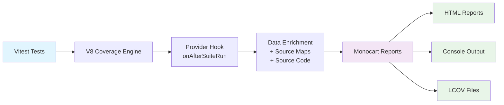

# @oorabana/vitest-monocart-coverage

[](https://badge.fury.io/js/@oorabona%2Fvitest-monocart-coverage)
[](https://github.com/oorabona/vitest-monocart-coverage/actions/workflows/ci.yml)
[](https://codecov.io/gh/oorabona/vitest-monocart-coverage)
[](https://opensource.org/licenses/MIT)
[](http://www.typescriptlang.org/)
[](https://vitest.dev/)

A Vitest custom coverage provider that integrates Vitest's V8 coverage engine with [Monocart coverage reporting](https://github.com/cenfun/monocart-coverage-reports) for enhanced visualization and features.

Architecturally speaking, it is not a full stack coverage provider but instead it sits on top of Vitest coverage-v8 package to enhance it by bridging it to Monocart.

## Features

- 🚀 **Direct V8 Integration**: Intercepts raw V8 coverage data before Istanbul conversion
- 📊 **Enhanced Reports**: Beautiful HTML reports with detailed coverage visualization
- ⚡ **In-Memory Processing**: No intermediate files, all data processed in memory
- 🎯 **Zero Data Loss**: Preserves all V8-specific coverage information
- 🔧 **Simple Configuration**: Single Vitest config, no extra setup required
- 📈 **Console Output**: Detailed coverage metrics in terminal
- ✅ **Configuration Validation**: Runtime validation of config files with clear error messages
- 🔄 **Multiple Config Formats**: Supports `.ts`, `.js`, `.mjs`, `.cjs`, and `.json` config files
- 🎨 **Auto-Discovery**: Automatically inherits Vitest's include/exclude patterns
- 🌐 **Browser Mode Support**: Works with @vitest/browser for frontend code coverage
- 🎨 **CSS Coverage**: Collect CSS coverage in browser environments

## Why Choose Monocart over V8 Default?

Vitest's default V8 provider has coverage accuracy issues with exception handling and complex code paths. See our [detailed coverage comparison](./docs/coverage-comparison.md) that shows:

- **V8 Default**: 97.56% branch coverage (false negatives in exception paths)
- **Monocart**: 100% branch coverage (accurate real-world coverage)

Read the full analysis: **[Coverage Provider Comparison](./docs/coverage-comparison.md)**

## Architecture & Design Decisions

### V8-Only vs Dual-Mode Approach

This provider takes an **opinionated V8-only approach**, unlike some alternatives that support both V8 and Istanbul instrumentation. Here's our reasoning:

#### 🎯 **Our Choice: V8 + Post-Processing Enhancement**

```
Vitest V8 Engine → Raw Coverage Data → Source Map Enrichment → Monocart Reports
```

**Benefits:**
- ⚡ **Maximum Performance**: No code instrumentation overhead (~10% vs ~300% for Istanbul)<sup>[1](#ref1)</sup>
- 🧩 **Architectural Simplicity**: Single data path, fewer failure points  
- 🚀 **Modern Approach**: Leverages V8's native capabilities with smart post-processing
- 📊 **Istanbul-Level Accuracy**: Since Vitest 3.2.0, V8 coverage uses AST-based remapping that "produces identical coverage reports to Istanbul"<sup>[2](#ref2)</sup>

#### 🔀 **Alternative: Dual-Mode (V8/Istanbul)**

Some providers offer runtime choice between V8 and Istanbul instrumentation:

```
Code → Istanbul Instrumentation → Modified Code → Coverage Collection
  OR
Code → V8 Native Collection → Raw Data Processing
```

**Trade-offs:**
- ✅ **User Choice**: Performance (V8) vs Maximum Precision (Istanbul)
- ❌ **Added Complexity**: Two codepaths to maintain and debug
- ❌ **Performance Cost**: Istanbul adds ~300% overhead when chosen<sup>[1](#ref1)</sup>

#### 💭 **Why V8-Only Works for Most Cases**

Modern V8 coverage with Vitest 3.2.0+ AST-based remapping achieves Istanbul-level accuracy<sup>[2](#ref2)</sup> for:
- Branch coverage in exception paths
- Complex conditional expressions  
- Real-world TypeScript/JavaScript codebases
- Source map resolution in transformed code<sup>[3](#ref3)</sup>

**Istanbul instrumentation** becomes valuable primarily for:
- Non-V8 environments (Firefox, Bun)<sup>[2](#ref2)</sup>
- Edge cases in AST parsing of non-standard ECMAScript<sup>[4](#ref4)</sup>
- Specific compliance requirements where instrumentation is mandated

#### 🔮 **Future Evolution**

We remain **open to adding Istanbul support** if there's strong community demand, but our philosophy prioritizes:
1. **Performance by default** (V8)
2. **Simplicity in architecture** 
3. **Excellence in the common case**

This approach serves 95% of use cases excellently while keeping the codebase maintainable and fast.

## Installation

```bash
npm install @oorabana/vitest-monocart-coverage
```

## Quick Start

Add the provider to your `vitest.config.ts`:

```ts
import { defineConfig } from 'vitest/config'
import { withMonocartProvider } from '@oorabana/vitest-monocart-coverage'

export default defineConfig({
  test: {
    include: ['tests/**/*.test.ts'],
    coverage: withMonocartProvider({
      outputDir: './coverage',
      reports: ['html', 'console-details', 'lcov'],
      name: 'My Project Coverage',
    }),
  },
})
```

That's it! Run `vitest --coverage` and you'll get enhanced coverage reports.

## Usage Modes

This provider supports both **Node.js** and **Browser** environments, allowing you to get comprehensive coverage for fullstack applications.

### Node.js Mode (Default)

Use the default import for Node.js tests (unit tests, API tests, etc.):

```ts
import { defineConfig } from 'vitest/config'
import { withMonocartProvider } from '@oorabana/vitest-monocart-coverage'

export default defineConfig({
  test: {
    environment: 'node',
    coverage: withMonocartProvider({
      outputDir: './coverage-node',
      reports: ['html', 'console-details', 'lcov'],
      name: 'Node.js Coverage',
    }),
  },
})
```

### Browser Mode

Use the browser import for frontend tests with @vitest/browser:

```ts
import { defineConfig } from 'vitest/config'
import { withMonocartProvider } from '@oorabana/vitest-monocart-coverage'

export default defineConfig({
  test: {
    browser: {
      enabled: true,
      provider: 'playwright', // or 'webdriverio'
      headless: true,
      instances: [{ browser: 'chromium' }],
    },
    coverage: {
      provider: 'custom',
      customProviderModule: '@oorabana/vitest-monocart-coverage/browser',
      customOptions: {
        outputDir: './coverage-browser',
        reports: ['html', 'console-details', 'lcov'],
        name: 'Browser Coverage',
        css: true, // Enable CSS coverage in browser mode
      },
    },
  },
})
```

### Fullstack Projects

For projects with both Node.js and browser code, you can use separate configurations:

```ts
// vitest.config.ts - Node.js tests
import { defineConfig } from 'vitest/config'
import { withMonocartProvider } from '@oorabana/vitest-monocart-coverage'

export default defineConfig({
  test: {
    include: ['tests/server/**/*.test.ts'],
    environment: 'node',
    coverage: withMonocartProvider({
      outputDir: './coverage-node',
      name: 'Server Coverage',
    }),
  },
})
```

```ts
// vitest.browser.config.ts - Browser tests
import { defineConfig } from 'vitest/config'

export default defineConfig({
  test: {
    include: ['tests/client/**/*.test.ts'],
    browser: {
      enabled: true,
      provider: 'playwright',
      instances: [{ browser: 'chromium' }],
    },
    coverage: {
      provider: 'custom',
      customProviderModule: '@oorabana/vitest-monocart-coverage/browser',
      customOptions: {
        outputDir: './coverage-browser',
        name: 'Client Coverage',
        css: true,
      },
    },
  },
})
```

Run both configurations:
```bash
# Node.js tests
vitest --coverage

# Browser tests  
vitest --config vitest.browser.config.ts --coverage
```

## How It Works

This provider works by intercepting V8 coverage data and enriching it before passing to Monocart:



**Key Steps:**
1. **Vitest Configuration**: Automatically sets V8 as coverage engine
2. **Data Interception**: Captures raw coverage before Istanbul transformation
3. **Source Enrichment**: Adds source code and maps from Vite's transform cache
4. **Report Generation**: Delegates to Monocart for multiple output formats

## Advanced Configuration

### Custom Options

```ts
export default defineConfig({
  test: {
    coverage: withMonocartProvider({
      // Basic options
      name: 'My Project Coverage',
      outputDir: './coverage',
      reports: ['html', 'console-details', 'lcov'],
      
      // Advanced options
      sourcePath: 'src',
      sourceFilter: (filePath) => !filePath.includes('node_modules'),
      cleanCache: true,
      logging: 'info',
      
      // Callback after report generation
      onEnd: (results) => {
        console.log('Coverage complete!', results)
      }
    }),
  },
})
```

### External Configuration

You can also use external configuration files. The provider automatically searches for config files in this order:

1. `monocart.config.mjs`
2. `monocart.config.js` 
3. `monocart.config.cjs`
4. `monocart.config.ts`
5. `monocart.config.json`

**monocart.config.ts:**
```ts
export default {
  name: 'My Project Coverage',
  outputDir: './coverage',
  reports: ['html', 'console-details'],
  logging: 'info',
  sourceFilter: (filePath: string) => {
    return !filePath.includes('test') && !filePath.includes('node_modules')
  },
  onEnd: (results) => {
    console.log(`Coverage complete! ${results.summary.statements.pct}% statements covered`)
  }
}
```

**monocart.config.json:**
```json
{
  "name": "JSON Config Example",
  "outputDir": "./coverage",
  "reports": ["html", "lcov"],
  "logging": "warn"
}
```

**vitest.config.ts:**
```ts
import { defineConfig } from 'vitest/config'
import { withMonocartProvider } from '@oorabona/vitest-monocart-coverage'

export default defineConfig({
  test: {
    coverage: withMonocartProvider(), // Will load config file automatically
  },
})
```

### Configuration Validation

The provider validates critical configuration properties at runtime:

- `outputDir` must be a string if provided
- `reports` must be an array if provided  
- `sourceFilter` must be a function if provided
- `logging` must be one of: "debug", "info", "warn", "error"
- `onEnd` must be a function if provided

Invalid configurations will throw clear error messages indicating the expected type and actual value received.

## Configuration Options

All configuration options for the Monocart provider:

| Option | Type | Default | Description |
|--------|------|---------|-------------|
| `name` | `string` | "Vitest Monocart Coverage" | Name displayed in coverage reports |
| `outputDir` | `string` | "./coverage" | Directory where reports will be generated |
| `reports` | `string[]` | ["v8", "console-details"] | Report formats to generate |
| `lcov` | `boolean` | `true` | Generate LCOV format report |
| `sourcePath` | `string` | `undefined` | Source path mapping for reports |
| `sourceFilter` | `function` | `undefined` | Function to filter which files to include |
| `cleanCache` | `boolean` | `true` | Clean cache before generating reports |
| `logging` | `string` | "info" | Logging level: "debug", "info", "warn", "error" |
| `css` | `boolean` | `false` | Enable CSS coverage collection (browser mode only) |
| `onEnd` | `function` | `undefined` | Callback executed after report generation |

## Report Types

Available report formats for the `reports` option:

- `'html'`: Interactive HTML report with line-by-line coverage
- `'console-details'`: Detailed console output with coverage metrics
- `'console-summary'`: Summary console output
- `'v8'`: Raw V8 coverage data
- `'lcov'`: LCOV format (also controlled by `lcov` option)

## Vitest Integration

The provider automatically inherits settings from your Vitest configuration:

- **Include/Exclude Patterns**: Uses Vitest's `coverage.include` and `coverage.exclude` for source filtering
- **Output Directory**: Uses Vitest's `coverage.reportsDirectory` if configured
- **Project Name**: Derives coverage name from Vitest's project name
- **Clean Cache**: Inherits from Vitest's `coverage.clean` setting

This ensures seamless integration with your existing Vitest setup while providing enhanced reporting capabilities.

## Important Notes

### Browser vs Node.js Mode Differences

| Feature | Node.js Mode | Browser Mode |
|---------|-------------|--------------|
| **Import** | `@oorabana/vitest-monocart-coverage` | `@oorabana/vitest-monocart-coverage/browser` |
| **Environment** | Node.js V8 engine | Chromium browser via CDP |
| **CSS Coverage** | ❌ Not available | ✅ Available with `css: true` |
| **Dependencies** | None | Requires `@vitest/browser` + `playwright`/`webdriverio` |
| **Performance** | Fastest | Slightly slower (browser startup) |
| **Use Cases** | Unit tests, API tests, server code | Component tests, UI integration, frontend code |

### CSS Coverage Requirements

CSS coverage is only available in **browser mode** because it requires Chrome DevTools Protocol access:

- ✅ **Browser Mode**: `css: true` enables CSS coverage collection via CDP
- ❌ **Node.js Mode**: CSS coverage is ignored (no effect)
- 🎯 **Browser Support**: Only works with Chromium-based browsers (Chrome, Edge, etc.)

To use CSS coverage:

```ts
// ✅ Correct: Browser mode with CSS coverage
export default defineConfig({
  test: {
    browser: { enabled: true, provider: 'playwright' },
    coverage: {
      provider: 'custom',
      customProviderModule: '@oorabana/vitest-monocart-coverage/browser',
      customOptions: { css: true }, // ✅ Works in browser mode
    },
  },
})

// ❌ Incorrect: Node.js mode (CSS ignored)
export default defineConfig({
  test: {
    environment: 'node',
    coverage: withMonocartProvider({ css: true }), // ❌ Ignored in Node.js
  },
})
```

## Documentation

- **[Coverage Provider Comparison](./docs/coverage-comparison.md)** - Detailed analysis of Monocart vs V8 default provider
- **[Release & CI Workflows](./docs/release-workflows.md)** - Complete guide to release processes and GitHub Actions

## Acknowledgments

This project was inspired by [cenfun/vitest-monocart-coverage](https://github.com/cenfun/vitest-monocart-coverage). Special thanks to cenfun for the original implementation and inspiration.

### Differences from Original

This implementation differs from the original in several key ways:

- **🔧 Enhanced Configuration**: Runtime validation, multiple config file formats support (`.ts`, `.js`, `.mjs`, `.cjs`, `.json`)
- **🎯 Auto-Discovery**: Automatic inheritance of Vitest's include/exclude patterns and settings
- **✅ Robust Error Handling**: Comprehensive validation with clear error messages and graceful fallbacks
- **🧪 Complete Test Coverage**: 100% branch coverage with extensive edge case testing
- **📚 Modern Architecture**: Dispatch pattern for config loading, improved TypeScript support
- **🌐 Browser Mode Support**: Dual Node.js/Browser support with conditional exports and CSS coverage
- **🛠️ Developer Experience**: Better logging, validation, and integration with Vitest ecosystem

## References

<a id="ref1"></a>**[1]** Vitest Code Coverage Documentation - Performance Comparison. *"The lead maintainer of Istanbul suggests 10% performance penalty for v8 vs 300% for Istanbul."* Available at: [vitest.dev/guide/coverage](https://vitest.dev/guide/coverage)

<a id="ref2"></a>**[2]** Vitest Guide - AST-Based Coverage Remapping. *"Since v3.2.0 Vitest has used AST based coverage remapping for V8 coverage, which produces identical coverage reports to Istanbul. This allows users to have the speed of V8 coverage with accuracy of Istanbul coverage."* Available at: [vitest.dev/guide/coverage](https://vitest.dev/guide/coverage)

<a id="ref3"></a>**[3]** Vitest Issue #5341 - Source Map Resolution Difference. *"Source map resolution difference between Istanbul and V8 coverage plugins."* Available at: [github.com/vitest-dev/vitest/issues/5341](https://github.com/vitest-dev/vitest/issues/5341)

<a id="ref4"></a>**[4]** Monocart Coverage Reports Documentation. *"AST parsing issues happen when source code is not in standard ECMAScript (like TypeScript or JSX), requiring manual compilation of the source code for these files."* Available at: [npmjs.com/package/monocart-coverage-reports](https://www.npmjs.com/package/monocart-coverage-reports)

## License

MIT
