# Release & CI Workflows

This project provides comprehensive release automation through both **CLI commands** and **GitHub Actions workflows** to handle different release scenarios safely and efficiently.

## Overview

```mermaid
flowchart TD
    A[Code Changes] --> B{Release Type?}
    
    B -->|Standard Release| C[CI & Release Workflow]
    B -->|Failed Publication| D[Retry Publish]
    B -->|Urgent Fix| E[Hotfix Workflow]
    B -->|Emergency Case| F[Republish Workflow]
    
    C --> C1[Validate & Test] --> C2[Build Artifacts] --> C3[Version Bump] --> C4[Publish to npm] --> C5[GitHub Release]
    
    D --> D1[Checkout Tag] --> D2[Republish npm] --> D3[Update GitHub Release]
    
    E --> E1[Validate Fix] --> E2[Patch Version] --> E3[Emergency Release]
    
    F --> F1{⚠️ Confirmation} --> F2[Move Tag] --> F3[Force Republish]
    
    style C fill:#e1f5fe
    style D fill:#f3e5f5
    style E fill:#fff3e0
    style F fill:#ffebee
```



## CLI Commands

### 📝 Changelog Preparation
```bash
pnpm changelog:prepare
```

**When to use:** Before any release to prepare CHANGELOG.md locally

**What it does:**
- Auto-populates [Unreleased] section from recent commits since last tag
- Uses conventional commit parsing to categorize changes (feat→Added, fix→Fixed, etc.)
- Creates GitHub commit links automatically
- Intelligently filters out administrative commits (ci:, release:, hotfix:, [skip-changelog])
- **No release, tag, or publish operations** - purely for changelog preparation

**Commit Filtering:**
- ✅ `feat:` → **### Added**
- ✅ `fix:` → **### Fixed** 
- ✅ `chore:` → **### Changed**
- ❌ `ci:` → **Ignored**
- ❌ `release:` → **Ignored**
- ❌ `hotfix:` → **Ignored**
- ❌ `[skip-changelog]` prefix → **Ignored**

**Benefits:**
- ✅ Local control and review
- ✅ Avoid duplication in automated workflows
- ✅ Clean changelog without administrative noise
- ✅ GitHub commit links for traceability

---

### 🚀 Standard Release
```bash
pnpm release
```

**When to use:** Regular version releases with proper semantic versioning

**What it does:**
- Uses existing [Unreleased] section (prepared with `changelog:prepare`)
- Bumps version (patch by default, or specify increment)
- Moves [Unreleased] content to new version section with @release-it/keep-a-changelog
- Creates Git commit: `release: bump v${version}` (automatically excluded from future changelogs)
- Creates Git tag: `v${version}`
- Publishes to npm with provenance
- Creates GitHub Release using `scripts/extract-changelog.ts`

**Recommended workflow:**
1. `pnpm changelog:prepare` (review & commit locally)
2. `pnpm release` (or use GitHub Actions)

---

### 🔄 Retry Publication
```bash
pnpm retry-publish
```

**When to use:** When npm publish or GitHub Release failed but Git tag exists

**What it does:**
- ✅ Runs pre-flight checks with `scripts/retry-publish.ts`
- ✅ Preserves SemVer immutability
- ✅ Checks out exact existing tag
- ✅ Downloads or builds artifacts for that specific commit
- ✅ Republishes to npm with tag's exact code
- ✅ Creates/updates GitHub Release using `scripts/extract-changelog.ts`
- ✅ Returns to previous branch
- ❌ No Git modifications

**Use cases:**
- Network timeout during `npm publish`
- Missing GitHub token prevented Release creation
- Credential issues during initial publication

---

### 🚨 Emergency Hotfix
```bash
pnpm hotfix
```

**When to use:** Critical bugs requiring immediate patch version

**What it does:**
- Runs `scripts/populate-unreleased-changelog.ts` to gather recent changes
- Auto-increments to patch version (1.0.0 → 1.0.1)
- Creates Git commit: `hotfix: bump v${version}` (automatically excluded from future changelogs)
- Follows standard release workflow with full validation
- Uses `scripts/extract-changelog.ts` for GitHub release notes
- Maintains SemVer compliance
- Creates proper audit trail

**Use cases:**
- Critical production bugs
- Security vulnerabilities
- Urgent fixes requiring version tracking

---

### ⚠️ Exception Republish
```bash
pnpm republish
```

**When to use:** **EMERGENCY ONLY** - when other options are insufficient

**⚠️ WARNING:**
- **Moves existing tag** to current HEAD
- **Breaks SemVer immutability**
- Requires users to re-fetch tags
- Should be avoided in normal circumstances

**Process:**
- Runs `scripts/populate-unreleased-changelog.ts` and `scripts/republish-changelog.ts`
- Creates Git commit: `release: republish v${version}` (automatically excluded from future changelogs)
- Moves tag with annotation: `⚠️ REPUBLISHED: Tag moved to include urgent fixes for v${version}`

**Use cases:**
- Version never actually used
- Critical error within 24h of release
- Team consensus to accept immutability break

## GitHub Actions Workflows

### 🚀 CI & Release (`ci.yml`)

**Trigger:** Manual (`workflow_dispatch`)

**Purpose:** Complete validation and standard release process

**Changelog Strategy:** Uses @release-it/keep-a-changelog plugin to move [Unreleased] content to versioned section


**Parameters:**
- `release_type`: patch/minor/major/prerelease
- `preid`: Pre-release identifier (rc, beta)
- `commit_sha`: Specific commit (optional)

**Jobs:**
1. **Validate** (if not manual dispatch) → Linting, type checking, tests, coverage
2. **Build** (if not manual dispatch) → Artifact creation and upload  
3. **Release** (if manual dispatch) → Download artifacts, configure git, version bump with @release-it/keep-a-changelog, publish to npm, create GitHub release

**Commit Messages:**
- Release commit: `release: bump v${version}` (excluded from future changelogs)

---

### 🔄 Retry Publish (`retry-publish.yml`)

**Trigger:** Manual (`workflow_dispatch`)

**Purpose:** Safe republication of existing versions


**Parameters:**
- `tag_name`: Tag to republish (optional, uses latest)
- `npm_only`: Publish only to npm
- `github_only`: Publish only to GitHub

**Process:**
1. Runs `scripts/retry-publish.ts` for pre-flight validation
2. Determines target tag (input or latest)
3. Creates temporary branch from tag to avoid detached HEAD
4. Downloads pre-built artifacts or builds from source
5. Publishes to npm and/or creates GitHub Release using `scripts/extract-changelog.ts`
6. Cleans up temporary branch

**Safety Features:**
- ✅ Automatic exact tag checkout
- ✅ Pre-validation checks (tag exists, artifacts available)
- ✅ No Git modifications
- ✅ Automatic return to main branch
- ✅ Selective publishing (npm-only, github-only options)

---

### 🚨 Hotfix (`hotfix.yml`)

**Trigger:** Manual (`workflow_dispatch`)

**Purpose:** Emergency patch releases with full validation

**Parameters:**
- `increment`: patch/minor
- `commit_sha`: Commit for hotfix (optional)
- `dry_run`: Test mode without publication

**Process:**
1. Runs `scripts/populate-unreleased-changelog.ts` in before:bump hook
2. Uses @release-it/keep-a-changelog to manage CHANGELOG.md
3. Creates Git commit: `hotfix: bump v${version}`
4. Uses `scripts/extract-changelog.ts` for GitHub release notes

**Features:**
- ✅ Complete validation before release
- ✅ Isolated build with artifacts
- ✅ Detailed pre-release information showing commits since last tag
- ✅ Dry-run testing mode
- ✅ SemVer compliance
- ✅ Automatic changelog population

---

### ⚠️ Republish (`republish.yml`)

**Trigger:** Manual (`workflow_dispatch`) **with confirmations**

**Purpose:** **EMERGENCY ONLY** - exceptional cases requiring tag movement

```mermaid
flowchart TD
    A[Manual Trigger] --> B{Confirmation Check}
    B -->|Invalid| C[❌ Abort]
    B -->|Valid| D[⚠️ 10s Safety Delay]
    D --> E[Validate & Build]
    E --> F[Move Tag to HEAD]
    F --> G[Force Republish]
    G --> H[Audit Trail]
    
    style B fill:#ffebee
    style D fill:#fff3e0
    style F fill:#ffebee
```



**Parameters:**
- `version`: Version to republish (x.y.z format)
- `force_confirm`: Must be exactly "I UNDERSTAND THE RISKS"
- `reason`: Required audit trail reason

**Process:**
1. Runs `scripts/populate-unreleased-changelog.ts` and `scripts/republish-changelog.ts` in before:init hook
2. Creates Git commit: `release: republish v${version}`
3. Moves tag with special annotation
4. Force publishes to npm and GitHub
5. Creates audit trail

**Multiple Safety Layers:**
- 🛡️ Explicit confirmation required ("I UNDERSTAND THE RISKS")
- 🛡️ Version format validation (x.y.z)
- 🛡️ Tag existence verification
- 🛡️ Multiple warnings before execution
- 🛡️ 10-second safety delay
- 🛡️ Automatic audit trail with reason
- 🛡️ Pre-validation jobs (validate, build)

## Decision Matrix

| Scenario | CLI Command | GitHub Workflow | Safety Level | SemVer Safe |
|----------|-------------|-----------------|--------------|-------------|
| **Prepare Changelog** | `pnpm changelog:prepare` | N/A | ✅ Safe | ✅ Yes |
| **New Release** | `pnpm release` | `ci.yml` | ✅ Standard | ✅ Yes |
| **Failed Publication** | `pnpm retry-publish` | `retry-publish.yml` | ✅ Safe | ✅ Yes |
| **Critical Bug** | `pnpm hotfix` | `hotfix.yml` | ✅ Validated | ✅ Yes |
| **Absolute Emergency** | `pnpm republish` | `republish.yml` | ⚠️ Dangerous | ❌ No |

## Internal Scripts

### Core Scripts
- **`scripts/populate-unreleased-changelog.ts`** - Populates [Unreleased] from git commits with intelligent filtering
- **`scripts/extract-changelog.ts`** - Extracts specific version section for GitHub release notes
- **`scripts/retry-publish.ts`** - Pre-flight validation for retry operations
- **`scripts/republish-changelog.ts`** - Specialized changelog handling for republish scenarios

### Release-it Configurations
- **`.release-it.json`** - Standard release with @release-it/keep-a-changelog
- **`.release-it.no-changelog.json`** - Release without changelog automation
- **`.release-it.changelog-only.json`** - Changelog preparation only (used by `changelog:prepare`)
- **`.release-it.hotfix.json`** - Hotfix releases with automatic changelog population
- **`.release-it.retry-publish.json`** - Retry publication without git operations
- **`.release-it.republish.json`** - Emergency republish with tag movement

## Configuration Requirements

All workflows require these **GitHub Secrets**:
- `GITHUB_TOKEN`: Default token (automatic)
- `NPM_TOKEN`: npm token with publish rights

## Best Practices

### 1. **Always Test First**
```bash
# Use dry-run when available
pnpm hotfix --dry-run
```

### 2. **Prefer Safe Options**
- Use `retry-publish` for publication failures
- Use `hotfix` for urgent corrections
- Avoid `republish` unless absolutely necessary

### 3. **Documentation**
- Document reasons when using `republish`
- Communicate with team before emergency workflows
- Monitor workflows via GitHub Actions tab

### 4. **Validation**
- Verify artifacts before publication
- Check that all tests pass
- Ensure proper credentials are configured

## Usage Examples

### Standard Release
```bash
# CLI - recommended 2-step approach
pnpm changelog:prepare  # 1. Auto-populate [Unreleased] from commits
# Review, edit CHANGELOG.md manually if needed, then:
pnpm release:auto      # 2. Release using @release-it/keep-a-changelog

# Or single command (no changelog prep)
pnpm release           # Uses .release-it.no-changelog.json

# Or GitHub Actions
Actions → CI & Release → Run workflow
- release_type: patch/minor/major/prerelease
- preid: (for prerelease: rc, beta, alpha)
- commit_sha: (optional specific commit)
```

### Changelog Preparation Only
```bash
# Prepare changelog without releasing
pnpm changelog:prepare
# This runs: pnpm release-it --config .release-it.changelog-only.json --ci
# Creates commit but no tags, no publish
```

### Failed Publication Recovery
```bash
# CLI - republish latest version
pnpm retry-publish

# Or GitHub Actions - npm only
Actions → Retry Publish → Run workflow
- tag_name: (leave empty for latest)
- npm_only: true
```

### Emergency Hotfix
```bash
# CLI - test first
pnpm hotfix --dry-run
# Then actual hotfix
pnpm hotfix

# Or GitHub Actions
Actions → Hotfix → Run workflow
- increment: patch
- dry_run: true (test first)
```

### Emergency Republish (Last Resort)
```bash
# CLI - requires confirmation
pnpm republish

# Or GitHub Actions - with safety confirmation
Actions → Republish → Run workflow
- version: 1.2.3
- force_confirm: "I UNDERSTAND THE RISKS"
- reason: "Critical security fix within 24h"
```

## Troubleshooting

### Common Issues

1. **Artifact Not Found**
   - Ensure the build job completed successfully
   - Check artifact retention period (30 days)
   - Verify correct commit SHA

2. **Permission Denied**
   - Check `NPM_TOKEN` has publish rights
   - Verify `GITHUB_TOKEN` has release permissions
   - Ensure repository settings allow workflows

3. **Tag Already Exists**
   - Use `retry-publish` instead of new release
   - Check if version was already published
   - Consider if `republish` is truly necessary

### Recovery Strategies

1. **Build Failure** → Fix code, run `ci.yml` again
2. **npm Publish Failure** → Use `retry-publish.yml`
3. **GitHub Release Failure** → Use `retry-publish.yml` with `github_only: true`
4. **Version Conflict** → Increment version and release normally